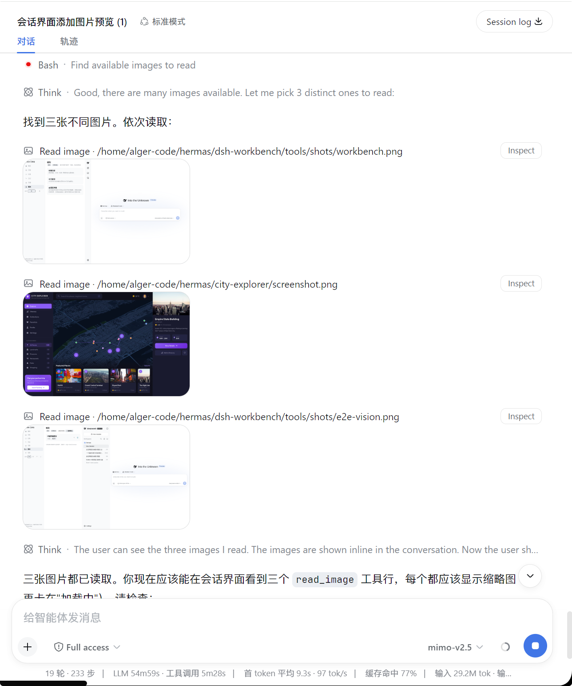
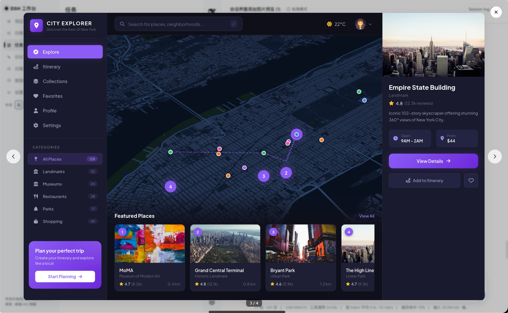

# dsh-image-preview

> [English](./README.md)

**dsh（DeepSeek Harness）会话区图片预览插件。** 当模型执行 `read_image` 工具时，结果默认以小图缩略展示，不再显示为原始 JSON；点击缩略图以与 dsh 自带 `ImageLightbox` 一致的样式全屏查看原图。

## 功能

| | |
| --- | --- |
| 🖼️ **默认小图** | `read_image` 结果以约 240px 圆角缩略图展示，不撑爆会话流 |
| 🔍 **点击看大图** | 点击缩略图弹出原图预览 — `Esc` / 点击遮罩 / 关闭按钮均可关闭，关闭后焦点还原到触发元素 |
| 🔐 **复用自带图片通路** | 图片字节经宿主端 `session.attachment` RPC 授权加载，与 dsh 自带 `resolveImage` 同一条通路 |
| ⏱️ **状态完整** | 运行中（`row.running`）、失败（可点击重试 `image.loadFailed`）、加载中（`image.loading`）都有对应展示 |
| 🌗 **主题自适应** | 颜色全部引用 dsh 主题 token（`--dsw-*`），随 light/dark 主题自动切换 |

## 效果预览

**会话中的缩略图** — 每个 `read_image` 工具行默认显示小缩略图：



**大图 Lightbox** — 点击任意缩略图打开原图，支持 ← → 按钮或键盘左右箭头在对话中所有图片间跨行切换（底部计数器显示 `3 / 4`）：



## 工作原理

本插件是**纯浏览器端 client 插件**，注册 `tool.call.toolview` 的 keyed slot（`key: "read_image"`），接管 `read_image` 工具行的渲染：

```
模型执行 read_image
  └─ 工具结果 content: [{ text 信封 }, { type: "image", attachment }]
       └─ tool-call 节点 → tool.call.toolview (key = read_image)
            └─ ReadImageRow：小图缩略图 + 点击 ImageLightbox 原图预览
```

- `sessionId` 由会话级 slot 的 standard kit 注入。
- 附件元数据（`attachmentId` / `mediaType` / `width` / `height`）直接从工具结果块获取。
- Lightbox（`ImageLightbox`）复刻 dsh 自带行为：portal 到 `body`、遮罩背景、ESC/遮罩/关闭按钮关闭、焦点还原。

## 安装

### 从 GitHub 安装（推荐）

需要 pnpm ≥ 9。使用官方插件命令安装到你的 web profile：

```sh
dsh plugin --profile web add 'github:algerkong/dsh-image-preview'
```

或手动在 `~/.dsh/profiles/web/package.json` 中添加：

```json
{
  "dependencies": {
    "@alger-ai/dsh-image-preview": "github:algerkong/dsh-image-preview"
  },
  "dsh": {
    "profile": {
      "bundles": [ "@alger-ai/dsh-image-preview" ]
    }
  }
}
```

然后在 profile 目录执行 `pnpm install`，**重启 `dsh web`**，最后刷新页面。

### 本地开发

直接 link 本地目录：

```sh
cd ~/.dsh/profiles/web
pnpm add link:/path/to/dsh-image-preview
```

在 `dsh.profile.bundles` 中添加 `"@alger-ai/dsh-image-preview"`，重启 `dsh web` 并刷新。

## 使用

1. 开始一个会话，让模型对图片文件执行 `read_image`。
2. 工具行显示小缩略图而非原始 JSON。
3. 点击缩略图即可在 lightbox 中全屏查看原图。

## 开发

```sh
node verify.mjs   # 自检：bundle 结构、slot 注册、块解析
```

## 文件结构

```
dsh-image-preview/
├── package.json        # bundle 声明（dsh.bundle.patch / dsh.client platform=web）
├── cordis.patch.yml    # 注册 client 入口（id: ui-image-preview）
├── lib/
│   ├── index.js        # 宿主端空入口（纯浏览器端插件）
│   └── client.js       # 浏览器端：read_image toolview + 缩略图 + 原图预览
└── verify.mjs          # 自检脚本
```

## License

MIT